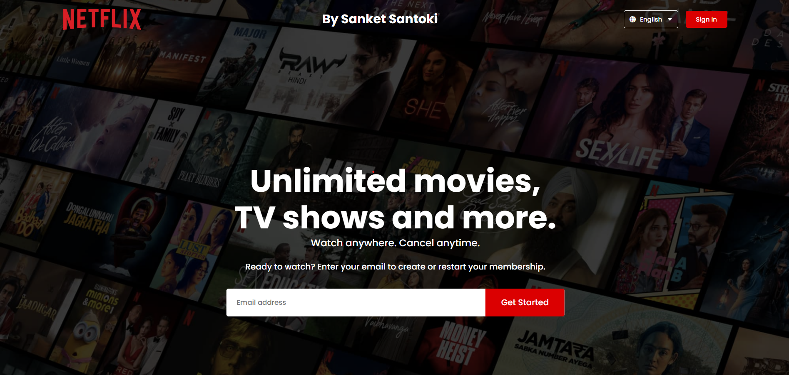

# Netflix Clone Project
Created the Netflix homepage using only HTML and CSS for BharatIntern's web development internship. Task 3 completed with ease and a touch of humor!

## Project Highlights
- 🖥️ HTML & CSS Mastery
- 💻 GitHub Profile: [Link](https://github.com/sanket-santoki/)
- 🚀 Live Demo: [Link](https://sanket-santoki.github.io/BharatIntern_NetflixHome/)

## Funny Note
Task 3 was so easy; even my coffee mug tried coding! ☕💻

Feel free to explore, contribute, and enjoy the HTML & CSS magic! 🍿✨

**Connect with me on LinkedIn:** [LinkedIn Profile](https://www.linkedin.com/in/sanket-santoki/)

# Technologies Used:
HTML
CSS
Bootstrap

# Credits:
Developed by Sanket Santoki
Internship at BharatIntern

Thank you for checking out. Stay informed, stay connected!
Happy coding! 🚀✨
